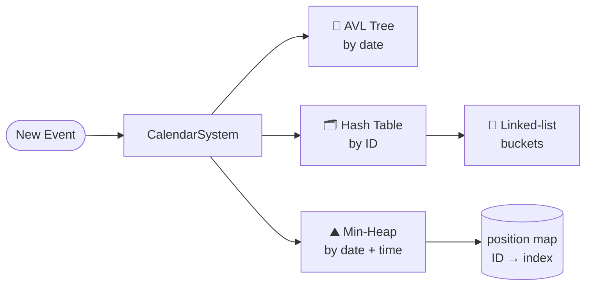
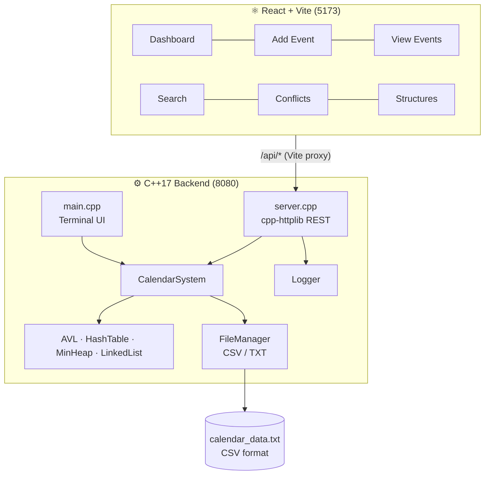

<p align="center">
  
</p>

<p align="center">
  
</p>

<p align="center">
  
  
  
  
  
  
</p>

---

## 🧠 What I Built

A **calendar / event-scheduling system** for my Data Structures & Algorithms course where the core engine is written in **C++17 using data structures I implemented myself** — not `std::map` or `std::priority_queue`. The same engine powers three front doors:

1. 🖥️ **`calendar_cli`** — an interactive terminal app
2. 🌐 **`calendar_server`** — a REST API (12 routes) built with cpp-httplib
3. ⚛️ **React dashboard** — add, search, edit and visualise events and detect time clashes

### 👨‍💻 My Role

Solo project — I designed the data-structure layer, the calendar logic, the REST server, the test suite and the React frontend, then refactored the original console version into a layered, memory-safe full-stack app.

---

## 🧱 The Data Structures

Every event is indexed **three ways at once**, each structure chosen for the query it answers best:

| Structure | File | Keyed by | Answers | Complexity |
|---|---|---|---|---|
| 🌳 **AVL tree** (self-balancing BST) | `bst.h/.cpp` | Date | "What's on 14-08-2026?" · in-order traversal for sorted listings | O(log n) insert/search |
| #️⃣ **Hash table** with chaining | `hash_table.h/.cpp` | Event ID | "Find / update / delete `EVT_42`" | O(1) average |
| 🔗 **Linked list** | `linked_list.h/.cpp` | — | Collision chains inside the hash table (31 prime-sized buckets, djb2 hash) | O(k) per bucket |
| ⛰️ **Indexed min-heap** | `min_heap.h/.cpp` | Date + start time | "What's coming up next?" | O(log n) insert **and delete-by-ID** |



### Engineering details I'm proud of

- **O(log n) heap deletion.** A naive heap delete is O(n). I keep an `unordered_map<id, index>` updated on every swap, so deleting any event jumps straight to it, swaps with the last element and sifts — O(log n).
- **AVL rotations.** The BST was upgraded to an AVL tree (`height` field + all four LL/RR/LR/RL rotation cases) so date queries never degrade to O(n).
- **Memory safety.** Every tree and list node is owned by `std::unique_ptr` — no manual `new`/`delete`, no leaks (this fixed a real leak in the original `clearAllEvents()`).
- **Correct time math.** Replaced string comparison (`"9:30" > "10:00"` lexicographically!) with minutes-since-midnight; end times that cross midnight get a `+Nd` suffix.
- **Conflict detection.** For any date, overlapping events are returned as conflict pairs and highlighted in the UI.
- **Robust persistence.** CSV save/load with proper quoting/escaping so descriptions can contain commas, quotes and newlines; formatted TXT export.
- **Production-style server.** JSON or form bodies, input validation with 400/404/409 status codes, CORS, a levelled logger, and graceful `SIGINT`/`SIGTERM` shutdown that auto-saves.

---

## 🏗️ Architecture



### REST API

| Method | Route | Purpose |
|---|---|---|
| `GET` | `/api/events` | All upcoming events (from the heap) |
| `POST` | `/api/events` | Create an event |
| `GET` | `/api/events/{id}` | Fetch one event (hash table) |
| `PUT` | `/api/events/{id}` | Update an event |
| `DELETE` | `/api/events/{id}` | Delete from all three structures |
| `GET` | `/api/events/date/{date}` | Events on a date (AVL tree) |
| `GET` | `/api/events/search?q=` | Search by title or ID |
| `GET` | `/api/events/conflicts/{date}` | Overlapping event pairs |
| `GET` | `/api/structures` | Live dump of the internal data structures |
| `POST` | `/api/save` · `/api/load` | Persist / reload CSV |
| `GET` | `/api/export` | Formatted TXT export |

---

## 🧪 Testing

`backend/src/test.cpp` uses **doctest** with **11 test suites and 161 assertions** covering `Event`, every data structure, the utility helpers (time parsing, CSV escaping/parsing), `CalendarSystem` and `FileManager`.

```bash
just test-backend        # or: ./backend/build/debug/test_runner
```

---

## 🚀 Getting Started

**Prerequisites:** a C++17 compiler (GCC/Clang/MSVC), CMake 3.20+, Node.js 18+. [`just`](https://github.com/casey/just) is optional.

```bash
# Backend — builds calendar_cli, calendar_server and test_runner
cd backend
cmake --preset debug && cmake --build --preset debug
./build/debug/calendar_server        # → http://localhost:8080

# Frontend
cd ../frontend
npm install && npm run dev           # → http://localhost:5173
```

On Windows, `start.bat` launches both servers at once; the `Justfile` has recipes for every build, run and test step.

---

## 📂 Project Structure

```text
DSA-Project/
├── backend/
│   ├── include/   # bst.h, hash_table.h, min_heap.h, linked_list.h, calendar.h, event.h, config.h, logger.h …
│   ├── src/       # implementations + main.cpp (CLI), server.cpp (REST), test.cpp (doctest)
│   └── CMakeLists.txt / CMakePresets.json
├── frontend/      # React 18 + Vite + React Router — 6 pages
├── Justfile       # build / run / test recipes
└── start.bat      # one-click launcher (Windows)
```

<p align="center">
  
</p>
